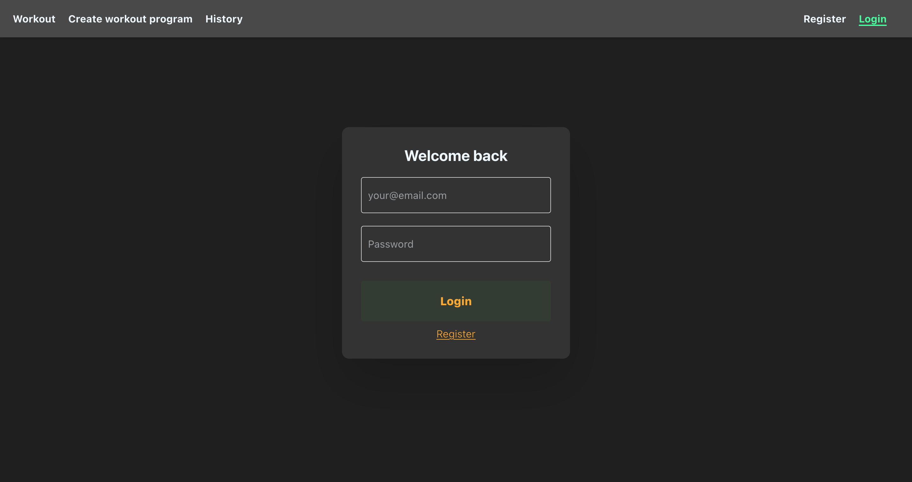
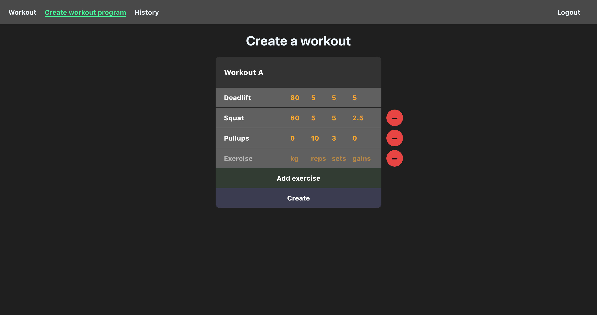
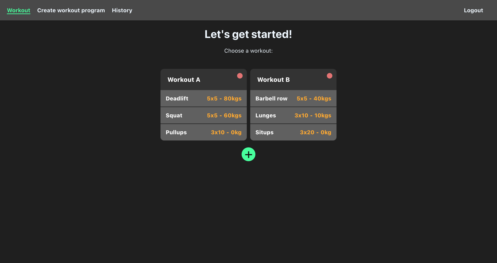
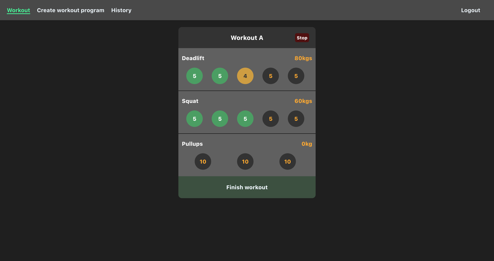
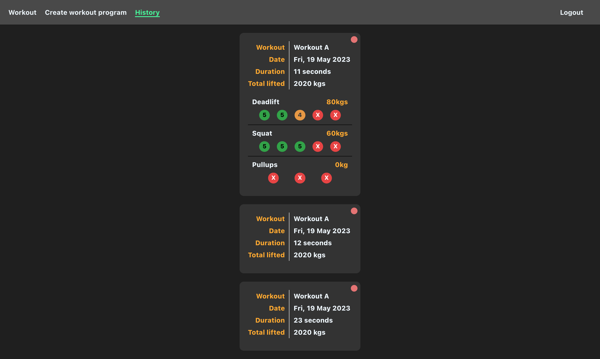

# A MERN stack exercise app

Try it out now: https://earnest-medovik-617695.netlify.app/

### Usage:

Users will need to sign-up first. Just provide an email and password. Password must be min 8 characters and include uppercase, lowercase, a number and a symbol.

    

Then the user can create a workout program. You need to provide a workout name, and a list of exercises that include the required weight, the reps and sets and how much you want to progress your weight after each workout. The progession will only activate if you successfully complete each set with the full reps, any dropped reps/sets will mean you will repeat the same weight in the next workout session.

    

Then you can choose which workout to do. You can also delete workout programs with the red circle in each card. There is no limit to the number of workout programs you can create. Clicking on a workout program will begin the workout and start the timer.

    

Then you can then do a workout session. The circle buttons can be clicked to record how many reps you were able to complete in each set, keep clicking to reset the set. You can stop a workout at any time by clicking the stop button at the top. Click 'Finish workout' to finalise your session.

    

You can review your workout history, including how your sets went for each exercise. There is also an indication of the total amount of weight lifted during the session - they can give some great motivation for your next session. You can delete workouts as well.

    

### Technologies

Back-end:
- Node
- Express
- MongoDB (hosted on Mongo Atlas)
- Mongoose
- jsonwebtoken
- bcryptjs
- validator

Front-end
- React
- create-react-app
- react-hook-form
- react-router-dom
- react-use